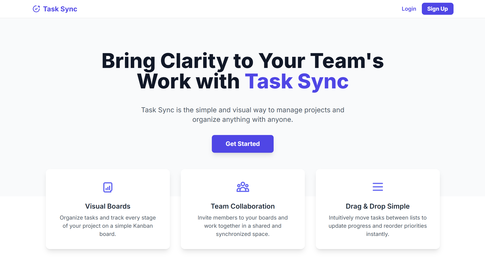
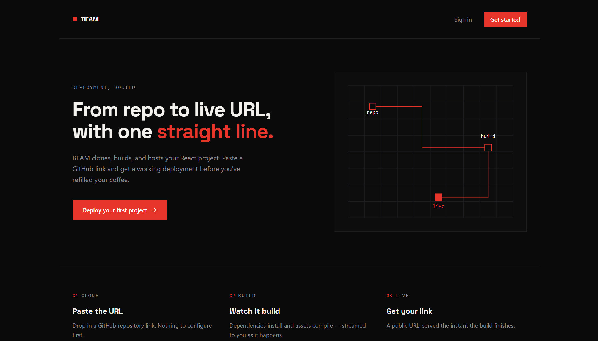
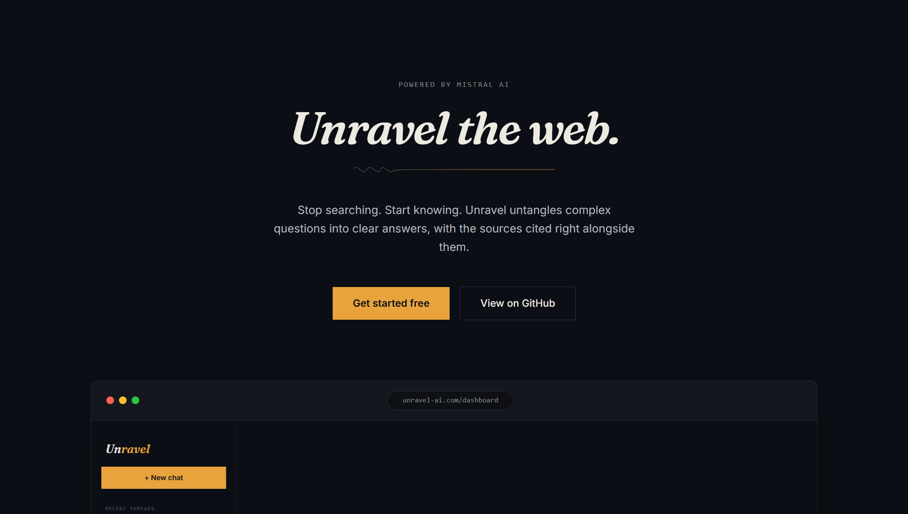
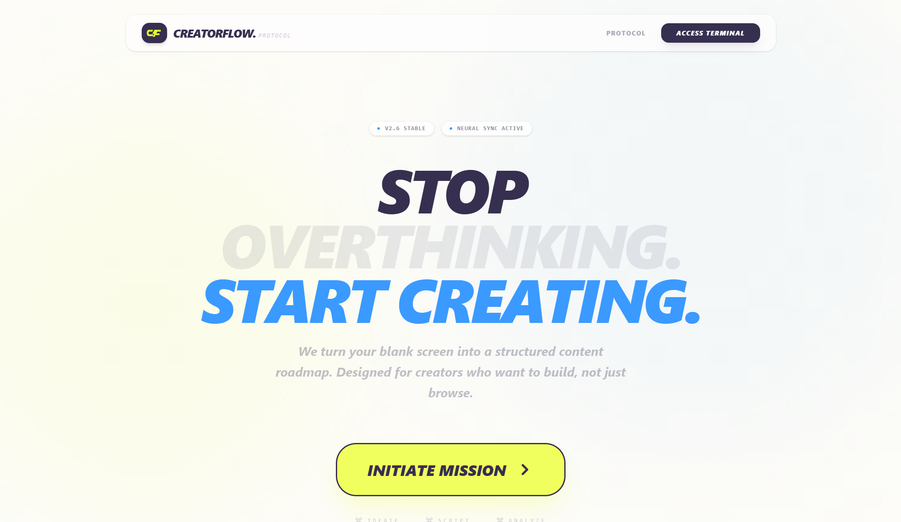

# Shivani Gujjar

**MERN Stack Developer · React.js | Node.js | MongoDB · AI-Integrated Web Apps · MCA @ LPU**

 

Hey, I'm Shivani a MERN Stack Developer currently pursuing my MCA at Lovely Professional University. I like owning a feature end-to-end: schema design, REST APIs, state management, and finishing with a clean, animated UI. Lately I've been building AI-integrated products with Gemini, Mistral, and LangChain, plus real-time systems powered by Socket.IO.

**currently**
- Pursuing MCA @ Lovely Professional University (2024 – 2026)
- Shipping AI-integrated MERN products - auth, real-time updates, LLM-powered features
- 🎓 AI-Powered Cohort 2.0 (Sheryians) · MERN Stack Development (Ducat) · Frontend Dev Internship (IBM SkillsBuild)
- Open to Frontend / MERN Stack Developer roles

 

## Selected Work

<table>
<tr>
<td width="30%"></td>
<td width="70%">

**[TaskSync](https://tasksync-delta.vercel.app/)** - Kanban task management platform with drag-and-drop boards, JWT auth, and Redux Toolkit state. `React.js` `Node.js` `Express.js` `MongoDB`
[live](https://tasksync-delta.vercel.app/) · [code](https://github.com/ShivaniGujjar/tasksync)

</td>
</tr>
<tr>
<td width="30%"></td>
<td width="70%">

**[Beam](https://beam-sable.vercel.app/)** - Mini frontend-hosting platform with live build logs and reverse-proxy routing. `React.js` `Node.js` `Socket.IO` `Redis` `Supabase`
[live](https://beam-sable.vercel.app/) · [code](https://github.com/ShivaniGujjar/beam)

</td>
</tr>
<tr>
<td width="30%"></td>
<td width="70%">

**[Unravel](https://unravel-liart.vercel.app/)** - AI assistant for technical Q&A and code prompts with streaming responses. `React.js` `Redux Toolkit` `Gemini` `Mistral`
[live](https://unravel-liart.vercel.app/) · [code](https://github.com/ShivaniGujjar/unravel)

</td>
</tr>
<tr>
<td width="30%"></td>
<td width="70%">

**[CreatorFlow](https://creatorflow-black.vercel.app/)** - AI-assisted workspace for content plans and scripts via LangChain workflows. `React.js` `Node.js` `MongoDB` `LangChain`
[live](https://creatorflow-black.vercel.app/) · [code](https://github.com/ShivaniGujjar/creatorflow)

</td>
</tr>
</table>

 

## Tech Stack

